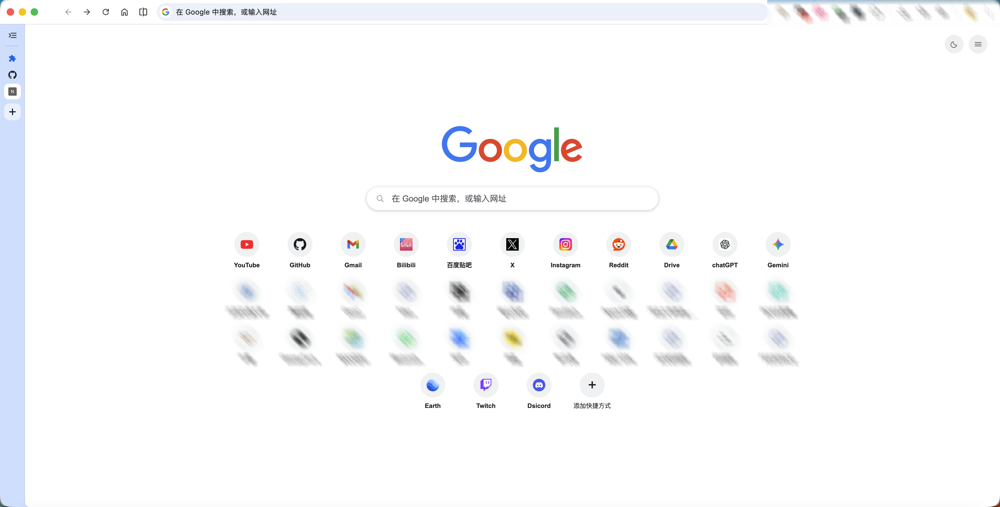
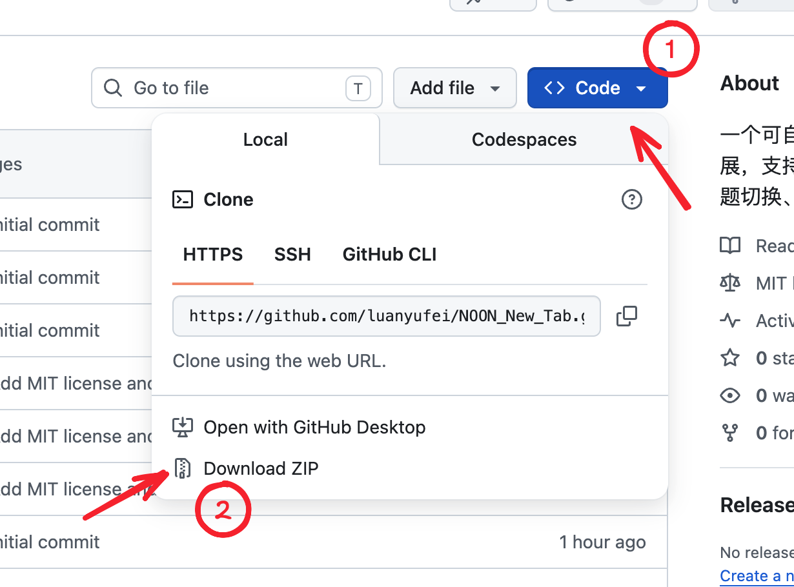
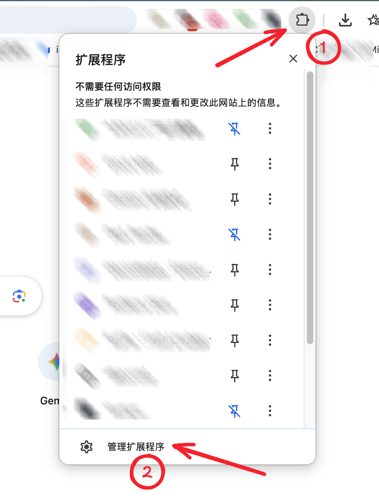
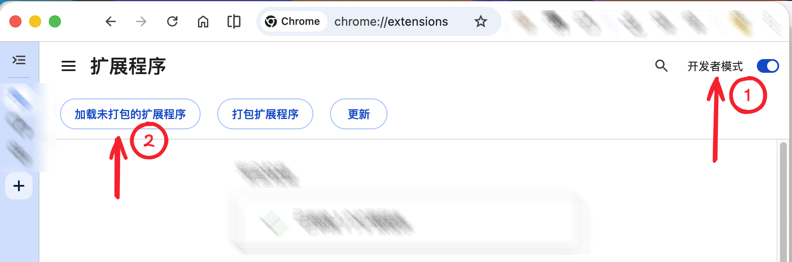

# NOON New Tab

[中文](./README.md) | English

A customizable new tab extension that tries to stay close to the native Chrome / Google new tab experience, while adding unlimited shortcuts, drag-and-drop sorting, theme switching, config import/export, and custom logo support.

## Background

The reason I built this extension is very straightforward. Chrome’s built-in new tab page does not support unlimited shortcut links, while many third-party new tab extensions are either paid or overly flashy. But the most important user need is actually much simpler: a clean, smooth, stable new tab page that supports a large number of shortcuts.

So the goal of this project is not to build a flashy dashboard, but to recreate the simple and direct Chrome new tab experience while improving the most important missing capability.

At the moment, this project is meant to reproduce the Chrome new tab page, so it still includes the Google logo and follows the visual and interaction style of the Chrome / Google new tab page.

Because of that, I am not publishing it to the Chrome Web Store for now. If I decide to publish it later, I may replace the current Google logo, remove visual elements that could make it look too close to an official Google product, and then prepare it again according to store policies.

## Features

- Unlimited shortcut links
- Drag-and-drop shortcut sorting
- Add, edit, and delete shortcuts
- Search box with suggestion dropdown
- Light and dark theme switching
- Import / export shortcut config as JSON
- Custom logo upload / clear
- Override the new tab page through `chrome_url_overrides.newtab`

## How to use

1. First, download the ZIP package of this project as shown below, then extract it to a local folder.

2. Open Chrome’s extensions page. You can open it as shown below, or type `chrome://extensions/` directly in the address bar.

3. Turn on `Developer mode` in the top-right corner, then click `Load unpacked` and select the extracted folder.

4. After that, open a new tab and Chrome will load this extension page. Done!

## Notes

- This is a personal project and is not affiliated with Google
- The UI style is inspired by the Chrome / Google new tab page, but the core goal is to improve the shortcut management limitations of the native new tab page
- `reference/` is only used as development reference material and is excluded from version control

## License

This project is licensed under the MIT License.

